- 웹 폰트, 임베드 폰트
	- 일관성 vs 성능
	- CJK(중국, 일본, 한국어) 폰트는 어마어마하게 크기 때문에, 특히 해외 사용자의 접속 속도에 매우 큰 영향
		- 스토어 오픈할 당시 빠른 3G에서 35초가 걸리고, 해외에서 페이지 로딩 시간도 15초가 넘게 걸림...
		- 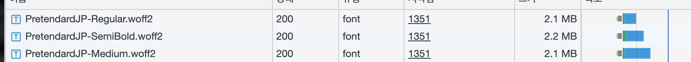{:height 77, :width 549}
		- 책이 쓰여질 때(2021년)와 달리 WOFF2 표준화가 진행되어, 중국 360 브라우저를 포함한 대부분의 브라우저(지원 종료된 ie 제외)에서 WOFF2를 지원
		- 최근에는 가변 폰트와 다이내믹 서브셋 덕분에, 폰트 굵기를 계산해서 쓸 수 있고, 사용하는 글자만 다운 받아 사용 가능
			- https://cactus.tistory.com/306
		- 이러한 놀라운 최적화로 6mb -> 674kb 로 줄어들었지만 여전히 네트워크의 1/3을 차지
- 타이포그래피
	- 폰트 종류 제한
		- 성능에도 문제지만, 디자인 일관성을 헤침
		- 저희는 Pretendard로 통일해서 사용해왔습니다.
	- 행간 1.5배 ~ 1.75배
		- 웹에서는 em을 사용하면 매번 계산하지 않아도 font-size의 배율로 쉽게 처리할 수 있음 ex) 1.5em
	- 자간
	- 줄바꿈을 어떻게?
		- 모바일 반응형을 고려하면 fold 같이 좁은 화면이 보통 문제가 됨
		- 줄바꿈은 단어 당 (keep-all), 글자마다 (break-all)로 설정할 수 있는데. 보통 한국어와 영어는 단어 단위로 쪼개고, 중국어나 일본어처럼 띄어쓰기가 없으면 글자마다 쪼갭니다
			- 단어마다 keep-all
				- 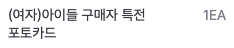
			- 글자마다 break-all
				- 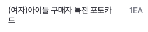
	- 색대비
		- 가독성이 떨어지고, 고객들이
		- APCA 기준이 새로 나왔습니다~ 자동 검사 도구가 점검도 해줍니다
		- https://web.dev/articles/testing-web-design-color-contrast?hl=ko
		- 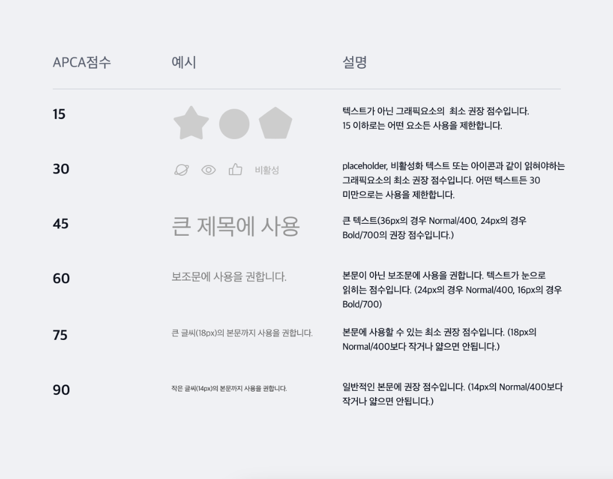{:height 389, :width 453}
		- 덜 중요한 보조문은 일부러 가독성을 떨어트리기도 합니다.
			- 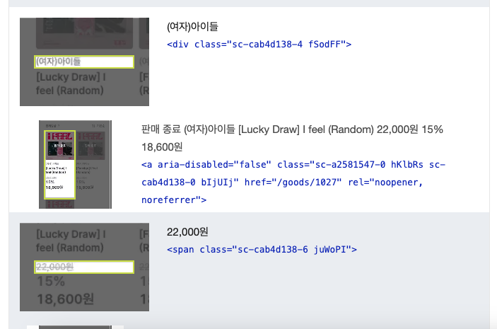{:height 268, :width 446}
	- 위계
		- 가격과 섹션 제목, 라벨을 강조
		- 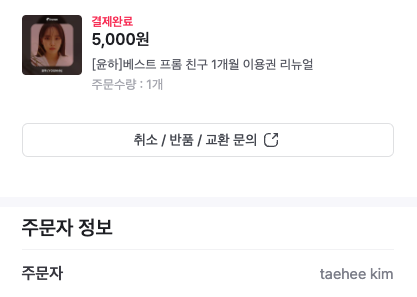
	- 성격에 맞는 폰트 선택
- 시각적 위계를 만들기
	- 크기
	- 색 primary vs mono
	- 질감
	- 공간감
	- 형태
	- 우리 서비스의 예시
		- 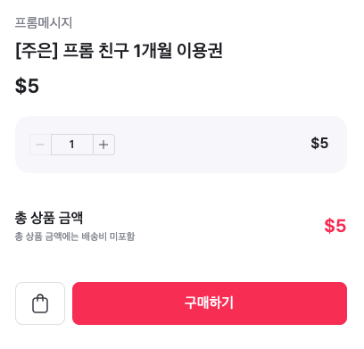{:height 399, :width 408}
		- 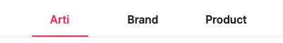
- 브랜드 컬러, 어포던스
	- 빨간색 primary color
	- 색상에 디자인 토큰을 적용해서 일관적으로 사용
	- 시스템 컬러
		- 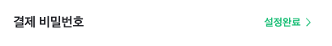
	- 우리에게 아쉬운 점...
		- 성공과 실패가 색으로 구분이 명확하게 되지 않음 (브랜드 컬러가 빨간색이라!)
		- 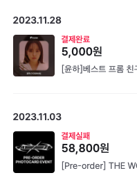{:height 216, :width 155}
- 그리드 시스템
	- Stack 혹은 flex 나 grid 등의 이름으로 다양한 플랫폼에서 표준화
	- 피그마에서는 auto layout이라는 이름으로 지원
	- 컬럼, 거터, 마진
		- 디자인할 때부터 width와 height를 픽셀로 명시하기 보다는~
		- flex와 grid로 디자인하면 개발하기에도 편하고 일관적이며 다양한 화면 크기에 적응적인 UI를 보여줄 수 있습니다
			- (웹에서는 거터를 gap이라 부릅니다. 슬프게도 옛날 브라우저에서 지원이 안 됨...)
		- 반응형 flex의 예시
			- 큰 화면
				- 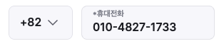
			- 좁은 화면
				- 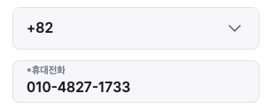
				-
- 반응형 디자인
	- 갤럭시 폴드부터 아이폰, 아이패드, 데스크탑까지...
- 다들 피보나치를 좋아함
	- 시각적 위계를 잡기 좋음!
- 아이콘
	- 공간이 좁을 때 특히 간결하게 UI를 만들기 좋음
	- 일관적이지 않고 관습적이지 않은 Icon은 이해하기 힘듬!
		- 아이콘에 툴팁을 같이 제공하는 경우도 많음
		- 다음은 트위터의 사례. hover 혹은 focus 시 색으로 강조하고, 툴팁이 나타납니다
		- 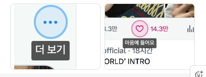
	- 사람들의 멘탈모델은 관습적인 것에 맞춰져 있으니 급진적이고 창의적인 icon을 사람들이 이해해줄 것이라 기대하면 안 되겠다~
- 시각 보정
	- 수치상으로는 똑같아도, 실제로 보기에는 크기가 달라보이는 '착시'를 보정
-